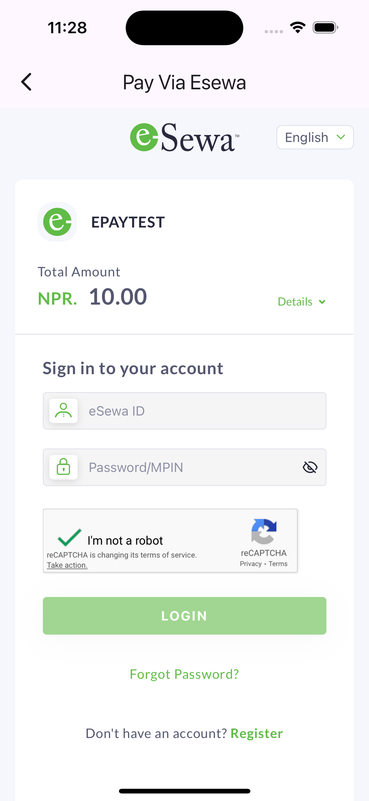

# eSewa Flutter [](https://twitter.com/intent/tweet?text=Flutter%20EsewaPayment%20plugin!&url=https://github.com/iamnabink/flutter_esewa&hashtags=flutter,flutterio,dart,wallet,esewa,paymentgateway) [](https://www.facebook.com/sharer/sharer.php?u=https%3A//github.com/iamnabink/flutter_esewa)

[](https://pub.dev/packages/esewa_flutter)
[](https://opensource.org/licenses/MIT)

An un-official Flutter plugin for eSewa Payment Gateway. With this plugin, you can easily integrate
eSewa Payment Gateway into your Flutter app and start accepting payments from your customers.
Whether you're building an eCommerce app or any other type of app that requires payments, this
plugin makes the integration process simple and straightforward.



</div>

### What’s new (v2 form + signature)
- Uses eSewa v2 form endpoint
- HMAC-SHA256 signature generated in Dart (no inline HTML)
- WebView posts `application/x-www-form-urlencoded`
- Success returns only base64 `data` via `EsewaPaymentResponse`

## Installation

Add the dependency in your app’s `pubspec.yaml`:

```yaml
dependencies:
  esewa_flutter: latestVersion
```

This package depends on:
```yaml
dependencies:
  flutter_inappwebview: ^6.1.5
  crypto: ^3.0.6
```

Run:
```bash
flutter pub get
```

## iOS and Android setup
- Ensure minimum Flutter 3 and a recent iOS/Android toolchain.
- iOS: WKWebView is used via `flutter_inappwebview`.
- Android: no extra setup beyond plugin requirements.

## Quick start

```dart
import 'package:esewa_flutter/esewa_flutter.dart';

// Inside a widget tree
EsewaPayButton(
  paymentConfig: ESewaConfig.dev(
    amount: 100.0,
    successUrl: 'https://developer.esewa.com.np/success',
    failureUrl: 'https://developer.esewa.com.np/failure',
    secretKey: 'YOUR_SECRET_KEY',
    // productCode: 'EPAYTEST', // optional for dev (defaults to EPAYTEST)
  ),
  onSuccess: (resp) {
    // resp.data is base64 string
    print('Success base64: ${resp.data}');
  },
  onFailure: (message) {
    print('Failed: $message');
  },
),
```

Or imperatively:

```dart
final result = await Esewa.i.init(
  context: context,
  eSewaConfig: ESewaConfig.live(
    amount: 100.0,
    successUrl: 'https://your.domain/success',
    failureUrl: 'https://your.domain/failure',
    secretKey: 'YOUR_SECRET_KEY',
    productCode: 'YOUR_MERCHANT_CODE',
  ),
);

if (result.hasData) {
  print(result.data!.data); // base64
} else {
  print(result.error);
}
```


With `EsewaPayButton`, the integration of eSewa Payment Gateway becomes even easier, as the payment
process can be initiated with just a single button press.

### Properties

The `EsewaPayButton` widget has the following parameters:

- `width`: The width of the button (default is `double.infinity`).
- `height`: The height of the button (default is `40.0`).
- `color`: The background color of the button (default is the primary color of the app).
- `borderColor`: The border color of the button (default is the primary color of the app).
- `onSuccess`: The callback function that is called when the payment is successful.
- `onFailure`: The callback function that is called when the payment fails.
- `paymentConfig`: The eSewa payment configuration object that is required to initialize the payment
  screen.
- `radius`: The border radius of the button (default is `4`).
- `widget`: An optional widget to be placed instead of the title text field. If the user wants to
  place a row with the eSewa icon or different widget.
- `title`: The title of the button (default is "Pay with Esewa").
- `textStyle`: The text style of the button title.


## Configuration

Constructors align to environments and endpoints:

```dart
// Live
ESewaConfig.live({
  required double amount,
  double? taxAmount = 0,
  double? productServiceCharge = 0,
  double? productDeliveryCharge = 0,
  double? totalAmount, // optional; defaults to amount + tax + service + delivery
  String serverUrl = 'https://epay.esewa.com.np/api/epay/main/v2/form',
  required String productCode, // Merchant product code
  String? transactionUuid,     // Optional; auto-generated if not provided
  required String successUrl,  // Redirect URL on success
  required String failureUrl,  // Redirect URL on failure
  String signedFieldNames = 'total_amount,transaction_uuid,product_code',
  required String secretKey,   // HMAC-SHA256 secret key
})

// Dev/RC
ESewaConfig.dev({
  required double amount,
  double? taxAmount = 0,
  double? productServiceCharge = 0,
  double? productDeliveryCharge = 0,
  double? totalAmount,
  String serverUrl = 'https://rc-epay.esewa.com.np/api/epay/main/v2/form',
  String productCode = 'EPAYTEST',
  String? transactionUuid,
  required String successUrl,
  required String failureUrl,
  String signedFieldNames = 'total_amount,transaction_uuid,product_code',
  required String secretKey,
})
```

### Field definitions
- amount: base amount to charge
- taxAmount: tax amount
- productServiceCharge: service charge
- productDeliveryCharge: delivery charge
- totalAmount: if omitted, computed as amount + tax + service + delivery
- serverUrl: v2 form endpoint for the target environment
- productCode: eSewa merchant code (EPAYTEST in dev)
- transactionUuid: unique id; auto-generated if null
- successUrl, failureUrl: your redirect endpoints
- signedFieldNames: fields included in signature (default aligns with v2 spec)
- secretKey: HMAC secret key provided by eSewa

## Return payload
On success redirect, the plugin expects a `data` query parameter with a base64 string and returns:

```dart
EsewaPaymentResponse(data: '<base64>')
```

On failure redirect, the plugin returns an error message if `message` exists, otherwise a generic failure message.

## How it works
- Creates a POST form body with fields: amount, tax_amount, total_amount, product_service_charge, product_delivery_charge, transaction_uuid, product_code, success_url, failure_url, signed_field_names, signature.
- Signature is generated as HMAC-SHA256 over:
  `total_amount=<...>,transaction_uuid=<...>,product_code=<...>`
  and base64-encoded.
- Loads an `InAppWebView` and posts to the configured v2 endpoint.
- Listens for navigation to your `successUrl` or `failureUrl` and completes accordingly.

## Troubleshooting
- Ensure your `successUrl` and `failureUrl` are reachable and match exactly in config.
- If you see "Couldn't resolve the package 'crypto'", run `flutter pub get` in the plugin and your app.
- If success occurs without `data`, the plugin returns failure by design. Ensure your backend redirects with the base64 `data` query param.


## Dev Testing Information

If you want to test eSewa payment integration in development environment, you can use the following
information:

- SecretKey:
SecretKey for every merchant partner will be provided from eSewa
For UAT, SecretKey will be `8gBm/:&EnhH.1/q` (Input should be text type.)

- Algorithm used for signature generation is SHA-256
- Test eSewa IDs: You can use any of the following test eSewa IDs for testing purposes:
    - 9806800001
    - 9806800002
    - 9806800003
    - 9806800004
    - 9806800005
- Password: Nepal@123
- OTP: 123456


## Run the example app

- Navigate to the example folder `cd example`
- Install the dependencies
    - `flutter pub get`
- Set up configuration `ESewaConfig.live()` or directly run with just `ESewaConfig.dev()` in dev
  mode
- Start the example
    - Terminal : `flutter run`

# License

This plugin is released under the MIT License. See LICENSE for details.

## Contributions

Contributions are welcome! To make this project better, Feel free to open an issue or submit a pull
request on [Github](https://github.com/iamnabink/flutter_esewa/issues)..

## Contact

If you have any questions or suggestions, feel free
to [contact me on LinkedIn](https://www.linkedin.com/in/iamnabink/).